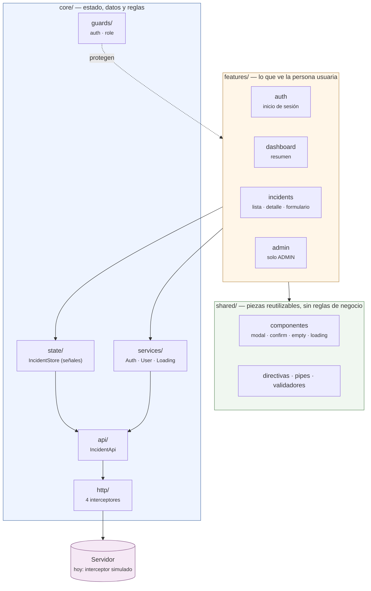
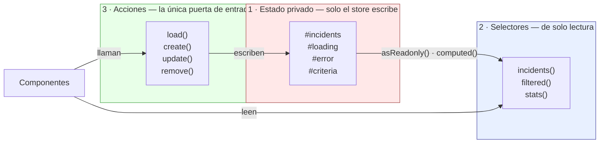
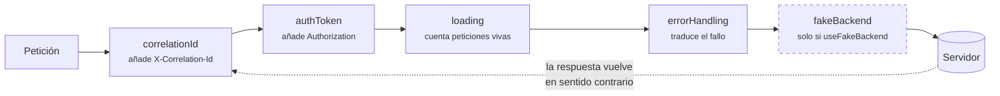
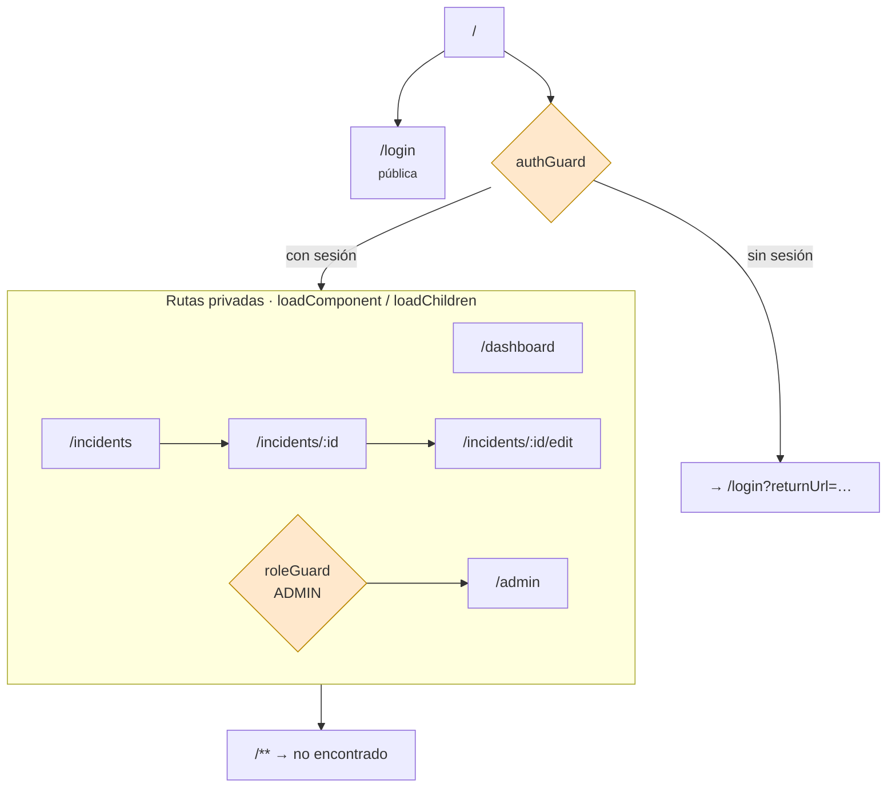

# Arquitectura del frontend

> Entregable del Día 29. Cómo está organizada la aplicación y, sobre todo,
> **por qué** está organizada así.
>
> Los diagramas son Mermaid: GitHub y VS Code los dibujan solos.

## 1. Vista general

Tres capas, con una regla que las gobierna: **las dependencias apuntan hacia
adentro**. Una funcionalidad puede usar `core` y `shared`; `core` no sabe que
las funcionalidades existen.



**Por qué esta dirección y no otra.** Es lo que permite borrar una
funcionalidad entera sin romper nada más, y lo que hace que el día que
aparezca un backend real solo haya que tocar `core/api`. Si `core` importara
de `features`, cualquier cambio en una pantalla podría romper el estado
compartido.

## 2. El camino de un dato

Esto es lo que de verdad hay que entender. Cuando alguien abre la lista de
incidencias:

```mermaid
sequenceDiagram
    participant U as Persona
    participant C as IncidentList<br/>(OnPush)
    participant S as IncidentStore
    participant A as IncidentApi
    participant I as Interceptores
    participant B as Backend

    U->>C: entra en /incidents
    C->>S: load()
    S->>S: loading = true
    S->>A: getAll(criterios)
    A->>I: GET /api/incidents
    Note over I: correlationId → auth →<br/>loading → errores
    I->>B: petición con cabeceras
    B-->>I: 200 · datos
    I-->>A: respuesta
    A-->>S: Incident[]
    S->>S: incidents.set(...) · loading = false
    Note over C: las señales avisan;<br/>Angular repinta solo esta rama
    C-->>U: lista en pantalla
```

Lo importante del último paso: el componente **no se suscribe a nada ni pide
que se redibuje**. Escribir en la señal del store es lo único que hace falta;
con `OnPush`, Angular repinta exactamente los componentes que leen esa señal.

## 3. El estado: un store de señales

`IncidentStore` sigue siempre el mismo patrón de tres capas:



**Por qué la separación importa.** Nadie puede escribir el estado desde fuera:
`asReadonly()` lo impide **en tiempo de ejecución**, no solo al compilar. Si
un dato aparece mal, la lista de sitios donde mirar son las acciones, y son
pocas. Un estado que cualquiera puede modificar convierte cada error en una
búsqueda por todo el proyecto.

Los datos derivados (`filtered()`, `stats()`) son `computed`: se recalculan
solos cuando cambia lo que leen y **no se guardan por duplicado**. Un estado
duplicado es un estado que tarde o temprano se desincroniza.

## 4. La cadena de interceptores

Cuatro interceptores, y **el orden no es decorativo**:



| Interceptor | Va donde va porque… |
|---|---|
| `correlationId` | primero, para que **todas** las peticiones lleven el identificador de rastreo |
| `authToken` | añade la sesión; se salta las rutas de `/auth/` para no mandar un token al pedirlo |
| `loading` | envuelve al resto: así el indicador también cuenta el tiempo de los errores |
| `errorHandling` | el más cercano al servidor: recibe el fallo en crudo y lo traduce a `AppHttpError` antes de que nadie lo vea |
| `fakeBackend` | cierra la cadena, y **entra solo si el entorno lo pide** |

La consecuencia práctica: ningún componente ni servicio sabe qué es un
`HttpErrorResponse`. Todos reciben un error ya traducido, con su mensaje y su
identificador de rastreo.

## 5. Rutas y carga diferida

Todo lo que no es la pantalla de acceso llega **cuando se pide**, no al
arrancar:



Dos detalles que cuestan poco y se agradecen:

- El guard guarda el destino en `returnUrl`, así que después de entrar se
  vuelve **a donde se quería ir**, no a una pantalla genérica.
- Sin permiso se va a `/forbidden`, **no** a `/login`: volver a entrar con la
  misma cuenta no daría acceso, y mandar ahí a alguien es hacerle perder el
  tiempo.

> ⚠️ Los guards impiden **navegar**, no impiden **pedir**. La autorización de
> verdad va en el servidor — riesgo **R-02** de
> [`riesgos-conocidos.md`](riesgos-conocidos.md).

## 6. Convenciones

| Regla | Motivo |
|---|---|
| Componentes standalone, sin `NgModule` | menos ceremonia; las dependencias se ven en el propio archivo |
| `ChangeDetectionStrategy.OnPush` en todos | con señales es lo natural: se repinta lo que cambió |
| Señales para el estado; RxJS para eventos en el tiempo | cada una en lo suyo: `debounce`, `switchMap` no tienen equivalente en señales |
| `inject()` en vez de constructor | funciona también en guards e interceptores, que son funciones |
| SCSS con BEM (`&-elemento`) | el nombre dice a qué bloque pertenece; sin colisiones entre pantallas |
| `track` obligatorio en `@for` | sin él Angular rehace el DOM entero en cada cambio |
| Un `.spec.ts` junto a lo que prueba | la prueba se mueve y se borra con su código |

## 7. Lo que no está aquí

Decisiones tomadas a conciencia, con su razón, en
[`decisiones-tecnicas.md`](decisiones-tecnicas.md). Lo que sigue abierto, en
[`riesgos-conocidos.md`](riesgos-conocidos.md).
