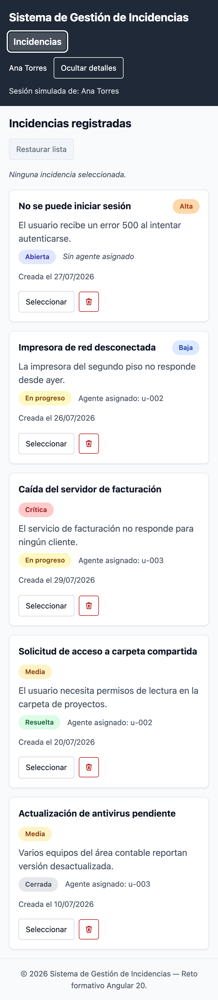
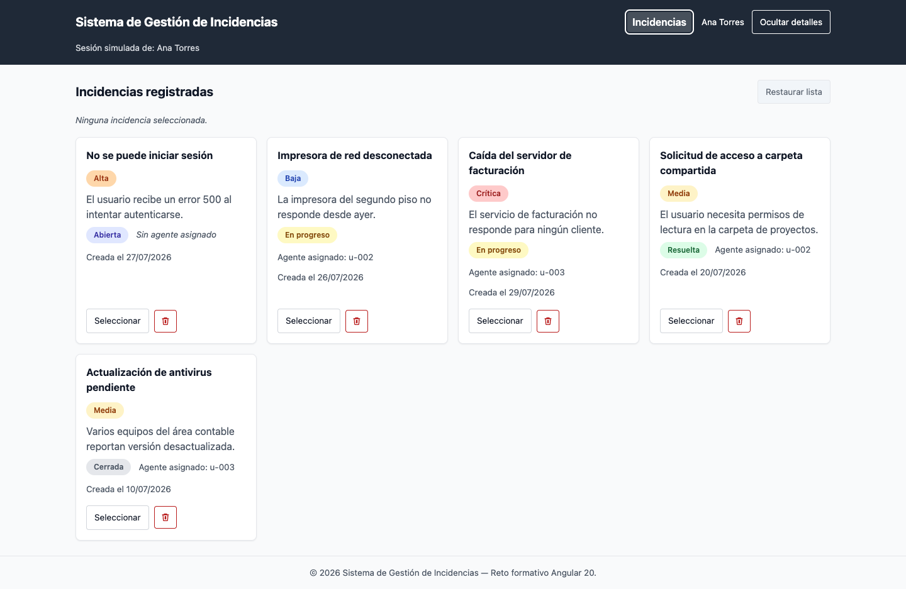

# Día 6 — Conceptos y paso a paso

> Documento de estudio del reto formativo de Angular 20.
> Objetivo del día: **construir una interfaz visualmente consistente,
> adaptable y accesible.**
> Entregable complementario: [Guía básica de estilos](./dia-06-guia-de-estilos.md).

## 1. Conceptos del día

### Encapsulamiento de estilos

Angular aísla por defecto los estilos de cada componente
(`ViewEncapsulation.Emulated`): al compilar, añade un atributo único a los
elementos del template (`_ngcontent-ng-c123456`) y lo inyecta en cada
selector del SCSS. El resultado es que `.incident-card` definido en
`incident-card.scss` **solo** afecta al template de ese componente, aunque
otro componente use exactamente el mismo nombre de clase.

```css
/* lo que escribimos */      .incident-card { padding: 1rem; }
/* lo que genera Angular */  .incident-card[_ngcontent-ng-c123456] { padding: 1rem; }
```

Consecuencias prácticas que aprovechamos hoy:

- No hace falta prefijar clases para evitar colisiones entre componentes.
- Lo que **sí** es global es `src/styles.scss` (declarado en `angular.json`):
  no recibe el atributo, así que aplica a toda la aplicación. Ahí viven los
  tokens, el reset, el anillo de foco y las clases `.btn`.
- Un componente **puede** usar clases globales en su template (`.btn`), pero
  no puede modificarlas desde su propio SCSS sin `::ng-deep` (que está
  desaconsejado). Por eso `app-header__toggle` no reescribe `.btn`: la
  acompaña.
- `:host` selecciona el elemento del propio componente
  (`<app-incident-card>`), que por defecto es `display: inline`. En la
  tarjeta lo cambiamos a `display: block; height: 100%` para que funcione
  como celda de la cuadrícula.

### Flexbox

Modelo de layout **unidimensional**: coloca elementos en una fila o una
columna y reparte el espacio sobrante. Es la herramienta para agrupar cosas
que van juntas en una línea.

```scss
.incident-card__meta {
  display: flex;
  flex-wrap: wrap;   // si no caben, bajan de línea en vez de desbordar
  gap: var(--space-3);
}
```

`flex-wrap: wrap` es clave para el diseño adaptable: sin él, los badges y
metadatos empujarían la tarjeta más allá del ancho de la pantalla.
En las acciones de la tarjeta usamos `margin-top: auto`, que consume todo el
espacio libre del contenedor flex en columna y **empuja el pie hacia abajo**,
alineando los botones de todas las tarjetas aunque tengan descripciones de
distinta longitud.

### CSS Grid

Modelo **bidimensional**: define filas y columnas a la vez. Es lo correcto
para una galería de tarjetas.

```scss
.incident-list__grid {
  display: grid;
  grid-template-columns: repeat(auto-fill, minmax(min(100%, var(--card-min-width)), 1fr));
  gap: var(--space-4);
}
```

Desglose:

- `repeat(auto-fill, ...)` — el navegador calcula cuántas columnas caben; no
  hay que declarar "2 columnas en tablet, 4 en escritorio".
- `minmax(X, 1fr)` — cada columna mide como mínimo `X` y como máximo una
  fracción igual del espacio.
- `min(100%, var(--card-min-width))` — el mínimo es 18rem, **salvo** que la
  pantalla sea más estrecha, en cuyo caso pasa a ser el 100% disponible.
  Sin esta parte, en un teléfono de 320px la columna seguiría exigiendo
  288px + padding y aparecería desplazamiento horizontal.

Regla mental: **Grid para la estructura de la página, Flexbox para el
contenido dentro de cada pieza.**

### Diseño responsive

Que la interfaz se adapte al ancho disponible en vez de tener una versión
"de escritorio" y otra "de móvil". El enfoque es **mobile-first**: el estilo
base es el del caso más estrecho y las media queries **añaden** a partir de
cierto ancho.

```scss
.app-header__bar {
  flex-direction: column;             // móvil: apilado

  @include bp.respond-from(sm) {      // ≥640px: en fila
    flex-direction: row;
    align-items: center;
  }
}
```

Tres piezas complementarias, todas necesarias:

1. `<meta name="viewport" content="width=device-width, initial-scale=1">` en
   `index.html` — sin esto el móvil finge ser un escritorio de 980px y
   reduce el zoom. (Ya venía del andamiaje del Día 1.)
2. Unidades relativas (`rem`, `%`, `fr`) en vez de píxeles fijos.
3. `overflow-wrap: anywhere` en títulos y descripciones, para que un texto
   largo sin espacios se parta en lugar de estirar su contenedor.

### Variables CSS

Las *custom properties* (`--nombre`) se declaran en un selector y las heredan
todos sus descendientes; se leen con `var(--nombre)`.

```scss
:root { --color-primary: #1d4ed8; }   // declaración global
.btn--primary { background-color: var(--color-primary); }
```

Diferencia con las variables de SCSS (`$color`): las de SCSS **desaparecen
al compilar** (son sustitución de texto), mientras que las CSS **siguen
vivas en el navegador**: se pueden cambiar en tiempo de ejecución, leer con
JavaScript y redefinir por contexto (por ejemplo, un tema oscuro sería
redefinir los tokens dentro de un `@media (prefers-color-scheme: dark)`, sin
tocar ni un selector más).

Por eso los colores y espaciados son variables CSS, pero los **breakpoints
son variables SCSS**: `@media (min-width: var(--bp))` no funciona, porque la
media query se evalúa antes de que existan las custom properties.

### HTML semántico

Usar el elemento que **significa** lo que el contenido es, en vez de `<div>`
para todo. El navegador y los lectores de pantalla derivan de ahí la
estructura del documento y los "puntos de referencia" para navegar.

Lo aplicado en la app:

| Elemento | Dónde | Por qué |
|---|---|---|
| `<header>` / `<main>` / `<footer>` | `app.html`, layout | Regiones de la página |
| `<nav aria-label="Navegación principal">` | header | Punto de referencia de navegación |
| `<section aria-labelledby>` | listado | Región con título asociado |
| `<ul>` / `<li>` | cuadrícula de tarjetas | Una lista de cosas **es** una lista: el lector anuncia "lista de 5 elementos" |
| `<article>` | cada tarjeta | Contenido autónomo y distribuible |
| `<h1>` → `<h2>` → `<h3>` | título, listado, tarjeta | Jerarquía sin saltos de nivel |
| `<time datetime="...">` | fecha de creación | Fecha legible por máquinas y por personas |
| `<button>` | acciones | Focusable y activable con teclado **sin escribir nada** |

Un `<div (click)>` no aparece en la tabulación, no se activa con Enter ni
Espacio y no se anuncia como botón. Usar `<button>` resuelve las tres cosas
gratis.

### Accesibilidad básica

Que la aplicación se pueda usar sin ratón, sin ver bien los colores o con un
lector de pantalla. Lo mínimo aplicado hoy:

- **Nombre accesible en todos los controles.** Es el texto que anuncia el
  lector. Normalmente es el contenido del botón; si el botón solo tiene un
  icono, hay que aportarlo con `aria-label`.
- **`aria-hidden="true"` en los iconos decorativos**, para que el SVG no se
  anuncie dos veces.
- **`aria-pressed`** en el botón de selección: comunica que es un
  interruptor y en qué estado está.
- **`aria-expanded` + `aria-controls`** en el botón de detalles del header:
  dice si el panel está desplegado y a qué elemento controla.
- **`aria-live="polite"`** en el mensaje de selección: al cambiar, el lector
  lo anuncia sin interrumpir lo que estaba leyendo.
- **Enlace "Saltar al contenido principal"** como primer elemento
  tabulable: permite esquivar la navegación repetida en cada página. Está
  oculto con `transform` hasta que recibe el foco.
- **El color nunca es el único indicador**: la tarjeta seleccionada suma un
  borde interior de 2px, no solo un tinte de fondo.
- **`.visually-hidden`** para texto que solo necesita el lector (por
  ejemplo "Prioridad: " antes del badge "Alta"). Se oculta con `clip-path`,
  no con `display: none` — este último lo oculta también a la asistencia.

### Estados de enfoque

El *foco* es dónde está "parado" el teclado. Si no se ve, la app es
inutilizable sin ratón. El error clásico es `outline: none` para quitar el
contorno azul del navegador sin poner nada en su lugar.

Usamos `:focus-visible`, que aplica cuando el navegador considera que el
usuario **está navegando con teclado**, y no al hacer clic con el ratón:

```scss
:focus-visible {
  outline: 2px solid var(--color-focus);
  outline-offset: 2px;
}
```

Sobre la barra oscura del header ese azul no contrastaría, así que ahí se
**cambia el color** del anillo a blanco — nunca se elimina:

```scss
.app-header :focus-visible { outline-color: var(--color-header-text); }
```

El `<main>` es la excepción justificada: recibe foco por programa desde el
skip link (`tabindex="-1"`), pero no es un control, así que no dibuja anillo.

### Metodología de nombres CSS

Convención para que el nombre de una clase diga qué es y dónde vive. Usamos
**BEM**: `bloque__elemento--modificador`.

```
.incident-card             → bloque (componente independiente)
.incident-card__title      → elemento (parte del bloque, sin sentido fuera)
.incident-card--selected   → modificador (variante del bloque)
```

Con el anidamiento `&` de SCSS se escribe una sola vez el prefijo:

```scss
.incident-card {
  &__title { }
  &--selected { }
}
```

Ventaja frente a anidar por estructura (`.card .header .title`): la
especificidad se mantiene plana (una sola clase), el estilo no depende de
cómo esté anidado el HTML y el nombre revela a qué componente pertenece.
Combinado con el encapsulamiento de Angular, el riesgo de colisión es
prácticamente nulo.

## 2. Paso a paso — cómo lo hicimos

1. **Definir los tokens globales** en [`src/styles.scss`](../src/styles.scss):
   un `:root` con colores, escala de espaciado de 4px, tipografía, radios,
   sombras y medidas de layout. Además, reset de `box-sizing`, estilos de
   `body` y `max-width: 100%` en imágenes y SVG.

2. **Crear los puntos de corte** en
   [`src/styles/_breakpoints.scss`](../src/styles/_breakpoints.scss) con el
   mixin `respond-from`, y registrar `src/styles` en
   `stylePreprocessorOptions.includePaths` de `angular.json` (en `build` y
   en `test`) para poder escribir `@use 'breakpoints'` desde cualquier
   componente sin rutas relativas largas.

3. **Añadir el sistema de botones y las utilidades globales**: `.btn` con
   sus modificadores y sus tres estados, `.visually-hidden`, `.skip-link`,
   el `:focus-visible` global y un bloque `prefers-reduced-motion` que anula
   las transiciones para quien lo tenga configurado en su sistema.

4. **Estructurar el layout raíz** (`app.html`): enlace de salto al
   contenido, `<main id="main-content" tabindex="-1">` y un contenedor
   centrado con `max-width: var(--layout-max-width)`.

5. **Rehacer el header**: barra apilada en móvil que pasa a fila desde `sm`,
   `<nav>` con nombre accesible y `routerLink` a *Incidencias*, y el botón de
   detalles con `aria-expanded` / `aria-controls`. Se cambió el
   `aria-pressed` que tenía por `aria-expanded`, que es el atributo correcto
   para un panel que se despliega.

6. **Construir la cuadrícula adaptable** en `incident-list.html/scss`:
   el `@for` del Día 4 ahora rellena un `<ul>` semántico con un `<li>` por
   tarjeta, y el `@empty` produce un `<li>` que ocupa todo el ancho
   (`grid-column: 1 / -1`). El mensaje de selección pasó a ser una región
   `aria-live="polite"`.

7. **Rehacer la tarjeta** (`incident-card.html/scss`): `<article>` con
   `<header>` y `<footer>` internos, `<time datetime>` para la fecha
   (formateada con `DatePipe`), etiquetas ocultas "Prioridad: " / "Estado: "
   antes de cada badge, y el botón de eliminar convertido en **botón solo
   con icono**, con `aria-label="Eliminar incidencia: <título>"` y el `<svg>`
   marcado `aria-hidden="true"`.

8. **Migrar todos los SCSS a tokens**: no queda ningún color ni espaciado
   literal en los archivos de componente, salvo los dos tintes de hover
   calculados sobre el primario.

9. **Ampliar las pruebas** a lo que el día exige verificar:

   - todos los controles son elementos nativos y tienen nombre accesible;
   - el botón de icono expone `aria-label` y oculta el SVG;
   - la selección se refleja en `aria-pressed` y se anuncia en la región
     `aria-live`;
   - las tarjetas se agrupan en `<ul>/<li>`;
   - **el listado no desborda a 320px de ancho** (se mide `scrollWidth`
     contra `clientWidth`);
   - el botón de restaurar se deshabilita cuando corresponde.

   Los specs de `App` y `Header` necesitaron `provideRouter([])` al
   introducir `routerLink` en el header.

   ```bash
   ng test --watch=false --browsers=ChromeHeadless   # 25 SUCCESS
   ```

10. **Auditar contraste** con un script que calcula el ratio WCAG 2.1 de los
    19 pares de color reales de la paleta. Detectó que el texto
    deshabilitado (`#6b7280` sobre `#f1f5f9`) se quedaba en 4.41:1; se
    sustituyó por `#5f6874` (5.15:1). Resultado final: **19/19 cumplen AA**.

11. **Auditar en el navegador real** (Chrome vía CDP) en 390×844 y
    1440×900, midiendo tres cosas por resolución:

    | Comprobación | Móvil | Escritorio |
    |---|---|---|
    | Desplazamiento horizontal | ✅ no (390/390) | ✅ no (1440/1440) |
    | Controles sin nombre accesible | ✅ 0 de 14 | ✅ 0 de 14 |
    | Paradas de tabulación sin anillo de foco | ✅ 0 de 15 | ✅ 0 de 15 |

    El recorrido con Tab empieza correctamente por "Saltar al contenido
    principal" y sigue por navegación → detalles → acciones de cada tarjeta
    en orden de lectura.

12. **Capturar la evidencia** en ambas resoluciones (ver sección 3) y
    **documentar el sistema** en la
    [guía básica de estilos](./dia-06-guia-de-estilos.md).

13. **Commit** con el mensaje sugerido por el reto:

    ```bash
    git commit -m "style(ui): implement responsive and accessible incident layout"
    ```

## 3. Evidencia en móvil y escritorio

### Móvil — 390×844

Una sola columna, barra superior apilada, badges y acciones dentro del ancho
de la pantalla, sin desplazamiento horizontal.



### Escritorio — 1440×900

La misma cuadrícula reparte cuatro columnas sin ninguna media query, con el
contenido centrado en el ancho máximo del layout.



## 4. Criterios de aceptación del día

| Criterio | Cómo se cumple |
|---|---|
| No existe desplazamiento horizontal injustificado | `min(100%, --card-min-width)` en la cuadrícula, `flex-wrap` en las filas y `overflow-wrap: anywhere` en los textos. Verificado en navegador real (390px y 1440px) y en una prueba automática a 320px. |
| Los controles pueden utilizarse mediante teclado | Todos son `<button>` o `<a>` nativos; recorrido con Tab verificado (15 paradas, todas con anillo de foco visible) y skip link como primera parada. |
| Los botones tienen nombres accesibles | 14/14 controles con nombre. El único botón de icono lo aporta con `aria-label` que incluye el título de la incidencia. |
| El contraste permite leer el contenido | 19/19 pares de la paleta ≥ 4.5:1 (WCAG AA), medidos y documentados en la guía de estilos. |

## 5. Resultado

- Sistema de diseño con tokens en `:root`, reutilizado por todos los
  componentes; ningún valor de color o espaciado literal fuera de
  `styles.scss`.
- Cuadrícula que va de 1 a 4 columnas sin una sola media query, y layout que
  sí las usa donde aportan (barra superior y cabecera del listado).
- Accesibilidad básica cubierta y **verificada**, no solo declarada:
  semántica, nombres accesibles, foco visible, contraste y anuncios en vivo.
- 25 pruebas unitarias en verde y auditoría de navegador sin hallazgos.
